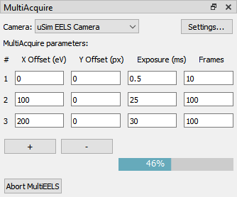
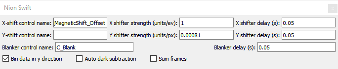
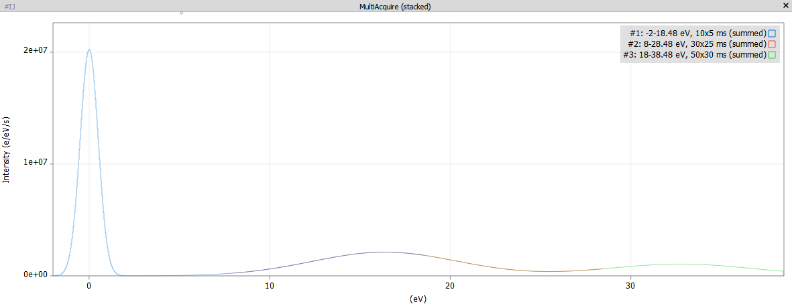

MultiAcquire
===========

A plug-in for Nion Swift¹ that acquires and displays multiple EEL spectra with different energy offsets.

______________________________________________________________________________________________________________________

Usage
=====

Main window
-----------
Get the plug-in main window by selecting it from the "Window" menu.

Screenshot:



### Summary
This plugin allows you to acquire EEL spectra with multiple energy offsets and exposure settings. The acquisitions can
be set up with the table in the main window. Every spectrum corresponds to one line. Use the "+" and "-" buttons to add or remove
lines. The first column shows the spectrum number, which will also be added to the titles of the result data items.
Note that the progress bar will only update once per spectrum (i.e. if only one spectrum is defined it will jump
straight from 0 to 100%).


Settings window
---------------
You can access the settings menu via the "Settings..." button in the top-right corner of the main window.



### Summary
In order to set the energy offsets, the plugin needs to know which control it has to change in AS2. Type the name of
this control into the "X-shift control name" field. If the field is empty, x-shifts are disabled, regardless of what
is configured in the main window.
The checkboxes in the bottom row allow you to configure how the data will be returned:

* "Bin data in y-direction" will sum the images in vertical direction to obtain spectra.
* "Auto dark subtraction" will blank the beam after the acquisition is finished and repeat it (with the exact same settings). This data will be then be used as dark images for the actual data. Make sure "Blanker control name" is set correctly, otherwise this mode will fail.
* "Sum frames" will sum all frames that were acquired for each spectrum (as specified by the column "frames" in the main window). If this is off, the plug-in will return a stack for each spectrum.


Output
------
The plug-in will create one result data item per spectrum. These data items can be either single spectra, single images,
stacks of spectra or stacks of images, depending on the settings. Additionaly the plug-in will create a data item that
contains all acquired spectra as multiple line plots. This last data item will only be created if "Bin data in y-direction"
is selected in the settings window.



______________________________________________________________________________________________________________________

Installation and Requirements
============================

Requirements
------------
* Python >= 3.6 (lower versions might work but are untested)
* numpy (should be already installed if you have Swift installed)

Installation
------------
The recommended way is to use git to clone the repository as this makes receiving updates easy:
```bash
git clone https://github.com/brow71189/MultiEELS
```

If you do not want to use git you can also use github's "download as zip" function and extract the code afterwards.

Once you have the repository on your computer, enter the folder "MultiEELS" and run the following from a terminal:

```bash
python setup.py install
```

It is important to run this command with __exactly__ the python version that you use for running Swift. If you installed Swift according to the online documentation (https://nionswift.readthedocs.io/en/stable/installation.html#installation) you should run `conda activate nionswift` in your terminal before running the above command.

¹ www.nion.com/swift